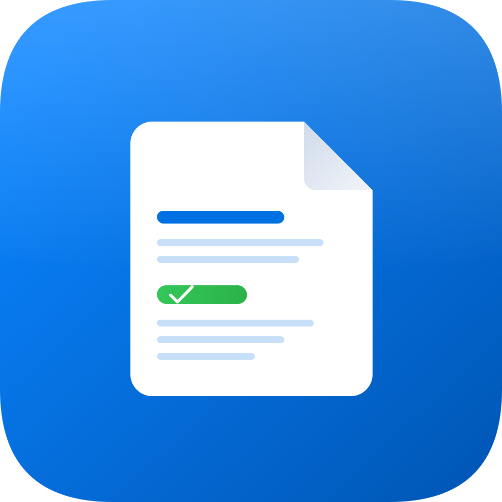
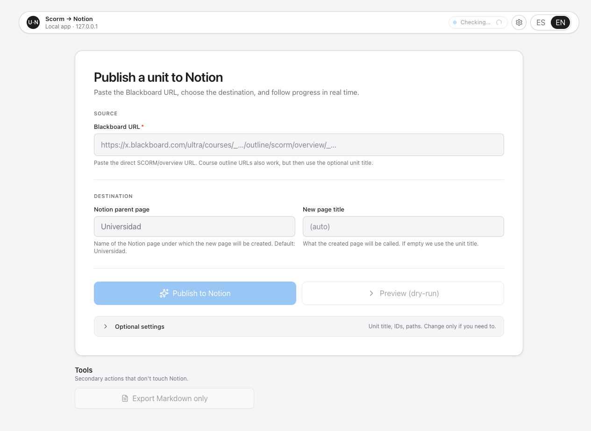
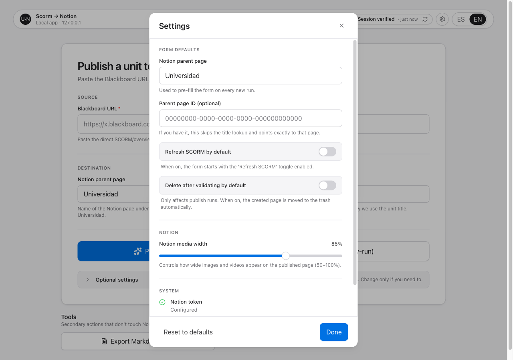

<p align="center">
  
</p>

<h1 align="center">SCORM → Notion</h1>

<p align="center">
  <a href="https://nodejs.org/"></a>
  <a href="#seguridad"></a>
  <a href="https://developers.notion.com/"></a>
  <a href="LICENSE"></a>
</p>

Convierte las unidades de tus asignaturas en Blackboard a páginas nativas de
Notion para tomar apuntes encima. Pegas la URL de la unidad, la app se encarga
del resto: descarga el contenido autenticado, lo convierte y lo sube como
bloques de Notion con imágenes, vídeos, tablas y listas.



## Índice

- [¿Qué hace esta app y para quién es?](#qué-hace-esta-app-y-para-quién-es)
- [Aviso de uso responsable](#aviso-de-uso-responsable)
- [Requisitos](#requisitos)
- [Instalación](#instalación)
- [Configuración (el `.env`)](#configuración-el-env)
  - [1. Conseguir tu token de Notion](#1-conseguir-tu-token-de-notion)
  - [2. Crear la página padre en Notion y darle acceso](#2-crear-la-página-padre-en-notion-y-darle-acceso)
  - [3. URL base de Blackboard](#3-url-base-de-blackboard)
- [Uso](#uso)
  - [1. Arranca la app](#1-arranca-la-app)
  - [2. Inicia sesión en Blackboard](#2-inicia-sesión-en-blackboard)
  - [3. Copia la URL de la unidad](#3-copia-la-url-de-la-unidad)
  - [4. Publica en Notion](#4-publica-en-notion)
- [Ajustes opcionales](#ajustes-opcionales)
- [Solución de problemas](#solución-de-problemas)
- [Seguridad](#seguridad)
- [Referencia técnica](#referencia-técnica)

## ¿Qué hace esta app y para quién es?

Si tu universidad usa Blackboard con Rise/SCORM y quieres pasar esos apuntes a
Notion para tomar notas encima sin copiar y pegar a mano, esta app lo
automatiza:

- Reutiliza tu sesión real de Blackboard (no se inventa credenciales).
- Descarga el contenido autenticado: textos, imágenes, vídeos.
- Crea una página nueva en Notion con bloques nativos (no como un PDF, no como
  un export raro). Editable, comentable, todo dentro del workspace.

La app es 100 % local. No envía nada a ningún servidor que no sea tu propio
ordenador y los servicios oficiales (Microsoft + Blackboard + Notion).

## Aviso de uso responsable

Esta herramienta automatiza la extracción y copia local de contenido
autenticado de Blackboard/SCORM. Muchos centros educativos tratan sus temarios,
materiales docentes y unidades formativas como contenido protegido por derechos
de propiedad intelectual, condiciones de uso internas u otras restricciones
propias. Usar esta app para copiar, conservar, transformar o publicar una unidad
SCORM sin permiso puede incumplir esas condiciones. Ejecútala únicamente sobre
contenido para el que cuentes con autorización explícita de tu universidad,
centro, profesor o titular correspondiente. El uso de la herramienta queda bajo
la responsabilidad exclusiva de la persona que la instala y ejecuta.

Dicho esto, la app funciona de forma local y no incorpora telemetría, avisos ni
mecanismos para notificar a tu universidad lo que haces con ella. No envía
reportes a Blackboard, al centro educativo ni a los autores del material: solo
usa tu sesión autenticada para leer el contenido que ya puedes abrir y, si tú lo
ordenas, subirlo a tu workspace de Notion. Como cualquier acceso normal a una
plataforma online, Blackboard o los servicios implicados pueden conservar sus
propios registros técnicos de actividad, pero esta aplicación no añade ningún
canal de notificación adicional.

## Requisitos

- macOS, Linux o Windows.
- [Node.js 20 o superior](https://nodejs.org).
- Una cuenta de Blackboard en tu universidad.
- Una cuenta de Notion (gratuita sirve).

## Instalación

```bash
git clone https://github.com/jnjambrin0/Scorm-web-scrapping.git
cd Scorm-web-scrapping
npm install
```

Si después de eso Playwright no encuentra un navegador (es raro pero pasa):

```bash
npx playwright install chromium
```

## Configuración (el `.env`)

La app solo necesita **dos valores** en un archivo `.env` para arrancar.
Copia el template:

```bash
cp .env.example .env
```

Abre `.env` con tu editor favorito. Tiene que quedar así:

```bash
NOTION_API_KEY=secret_xxxxxxxxxxxxxxxxxxxxxxxxxxxxxxxxxxxxxxxxxx
BLACKBOARD_BASE_URL=https://<tu-institución>.blackboard.com/ultra/stream
```

Sustituye `<tu-institución>` por el subdominio real de tu universidad
(el que ya aparece en la URL del navegador cuando estás dentro de Blackboard).

Las dos secciones siguientes explican cómo conseguir cada valor.

### 1. Conseguir tu token de Notion

1. Entra a [notion.so/profile/integrations](https://www.notion.so/profile/integrations)
   con tu cuenta.
2. Pulsa **+ New integration** o ** Nueva conexión**.
3. Rellena:
   - **Name**: `SCORM Sync` (o cualquier nombre reconocible).
   - **Associated workspace**: tu workspace.
4. Guarda → entra dentro de la integración recién creada → pestaña
   **Configuration**.
5. En **Capabilities** marca:
   - ✅ Read content
   - ✅ Update content
   - ✅ Insert content
6. En la misma pestaña copia el **Internal Integration Token** (empieza por
   `secret_` o `ntn_`).
7. Pégalo en `.env` como `NOTION_API_KEY`.

### 2. Crear la página padre en Notion y darle acceso

La app crea cada unidad como una página **hija** dentro de una página que tú
elijas. Esa "página padre" es donde se irán acumulando todos tus apuntes.

1. En Notion, crea (o reutiliza) una página llamada **Universidad**. Si
   prefieres otro nombre, también vale — luego lo cambias en los Ajustes de
   la app.
2. Abre esa página → menú `···` arriba a la derecha → **+ Connections** →
   busca el nombre de tu integración (la del paso 1) → **Confirm**.

Sin este paso, tu token no podrá crear páginas dentro.

### 3. URL base de Blackboard

Es la URL en la que tu navegador aterriza cuando ya has iniciado sesión en
Blackboard. Tiene esta forma:

```
https://<tu-institución>.blackboard.com/ultra/stream
```

El subdominio cambia según la universidad. Si no estás seguro:

1. Entra a Blackboard como sueles hacerlo desde el navegador.
2. Mira la URL del navegador.
3. Copia la parte hasta `/ultra/stream`.
4. Pégala en `.env` como `BLACKBOARD_BASE_URL`.

## Uso

### 1. Arranca la app

```bash
npm run dev
```

Abre la URL que imprima Vite, normalmente
[http://127.0.0.1:5173](http://127.0.0.1:5173).

Si aparece un banner amarillo "Configuración incompleta", revisa el `.env` y
reinicia el comando.

### 2. Inicia sesión en Blackboard

En la barra superior verás un chip de sesión. Posibles estados:

- 🟢 **Sesión verificada** — todo correcto, sigue al paso 3.
- 🟡 **Inicia sesión en Blackboard** — pulsa el chip. Se abre una ventana de
  Chromium con la pantalla de login de tu universidad. Mete tus credenciales,
  completa MFA si lo tienes, y **cuando aterrices correctamente en Blackboard,
  cierra esa ventana**. La app re-verificará la sesión sola.
- ⚪ **Sin verificar** — pulsa el chip para verificar.

La sesión se guarda en un perfil local de Chromium. No vuelves a tener que
loguear hasta que tu universidad invalide la sesión (suele durar varios días).

### 3. Copia la URL de la unidad

En Blackboard, dentro de tu navegador normal:

1. Entra a la **asignatura** que te interese.
2. Entra al **tema** que quieres convertir.
3. Haz clic en **Apuntes** (o como tu profesor haya llamado al SCORM de la
   unidad).
4. **Sin esperar a que se cargue la unidad**, copia la URL de la barra de
   direcciones del navegador.

La URL tiene esta forma:

```
https://<tu-institución>.blackboard.com/ultra/courses/_COURSE_1/outline/scorm/overview/_ITEM_1?courseId=_COURSE_1
```

### 4. Publica en Notion

De vuelta en la app local:

1. Pega la URL en el campo **URL de Blackboard**.
2. Comprueba que **Página padre en Notion** dice el nombre de la página que
   compartiste con tu integración (paso 2 de Configuración).
3. (Opcional) Escribe un título para la nueva página de Notion. Si lo dejas
   vacío, se usa el título que ponga la unidad en Blackboard.
4. Pulsa **Vista previa (dry-run)** para una pasada de validación: descarga
   todo y prepara los bloques, **sin tocar Notion**.
5. Si los contadores (lecciones, bloques, imágenes, vídeos) tienen pinta de
   estar bien y los fallos son cero, pulsa **Publicar en Notion**.
6. Espera a que termine — verás barra de progreso y fases. Suele tardar entre
   1 y 5 minutos por unidad.
7. Al terminar pulsa el botón verde **Abrir página en Notion** para verla en
   tu workspace.

## Ajustes opcionales

Icono de engranaje en la barra superior → modal de Ajustes:



Puedes cambiar:

- **Página padre en Notion**: cambia el valor por defecto del formulario
  (útil si tu página se llama distinto a "Universidad").
- **ID de página padre** (opcional): si tienes varias páginas con el mismo
  nombre y quieres apuntar a una concreta.
- **Refrescar SCORM / Borrar tras validar por defecto**: si te interesa que
  esos toggles arranquen activados.
- **Ancho de medios en Notion**: ajusta cómo de anchas se ven imágenes y
  vídeos en las páginas que se publiquen (50–100 %).
- **Tengo Notion Plus, Business o Education**: controla el filtro de tamaño
  de archivos. Notion limita cada subida a **5 MiB en el plan gratuito** y a
  **5 GiB en los planes de pago** (Plus, Business, Education, Enterprise).
  Activado por defecto porque la mayoría de estudiantes tenéis
  [Notion Education gratis](https://www.notion.com/students). Detalles:
  - **Activado**: subimos todo sin comprobaciones previas.
  - **Desactivado**: cualquier imagen o vídeo por encima de 5 MiB se omite
    automáticamente y en su sitio aparece un párrafo `[Imagen omitido: nombre
    — supera 5 MiB del plan gratuito de Notion]`. Así el publish no falla.
  - Si lo dejas activado pero tu workspace es Free, Notion devuelve
    `file_upload_invalid_size`. La app lo detecta y te muestra un error con
    tres opciones: desactivar el switch, contratar
    [Education](https://www.notion.com/students) (gratis para estudiantes
    verificados) o pasar a [Plus / Business](https://www.notion.com/pricing).
- **Sistema**: ver de un vistazo si tu `.env` está bien configurado.

Los cambios se guardan automáticamente (no hay botón "Guardar").

## Solución de problemas

| Síntoma | Qué hacer |
|---|---|
| Banner amarillo **"Configuración incompleta"** | Falta una variable en `.env`. Revisa la sección [Configuración](#configuración-el-env) y reinicia `npm run dev`. |
| Chip dice **"Inicia sesión en Blackboard"** ámbar | Tu sesión está caducada (o nunca has hecho login). Pulsa el chip y completa el login. |
| Toast **"Blackboard no responde"** | Internet lento o la URL del curso no carga en 30 s. Reintenta cuando tengas mejor conexión. |
| Toast **"URL no accesible"** | El dominio que pusiste en `BLACKBOARD_BASE_URL` no resuelve. Probable typo en el subdominio. |
| Error **"Notion ha rechazado la petición"** | Tu integración no tiene acceso a la página padre. Comparte la página padre con la integración (paso 2 de configuración). |
| Error **"Notion rechazó un archivo por tamaño"** | Algún archivo supera el límite de tu workspace (5 MiB en Free, 5 GiB en Plus/Business/Education). Ve a Ajustes y desactiva **"Tengo Notion Plus, Business o Education"** para que los archivos grandes se omitan automáticamente, o sube de plan (Education es gratis para estudiantes). |
| Error **"Sesión de Blackboard caducada"** durante un publish | Microsoft te ha invalidado la sesión a mitad de proceso. Cancela el job, pulsa el chip para re-loguear, y reintenta. |
| **"Navegador de Playwright no instalado"** | Ejecuta `npx playwright install chromium` en la raíz del proyecto. |

Si nada de lo anterior cuadra, abre los detalles técnicos del toast o de la
tarjeta de error: incluyen las últimas líneas del log con el error real.

## Seguridad

- Todo el flujo es **local**. La API solo escucha en `127.0.0.1:8787` y se
  niega a arrancar en otras direcciones.
- Las cookies de Blackboard se guardan en un perfil de Chromium privado, por
  defecto en `~/.scorm-scraping/chromium-profile`. Trátalo como material
  sensible: si lo copias, copias tu sesión.
- No subas a Git: `.env`, `exports/`, `artifacts/` ni el perfil de Chromium.
  Ya están en `.gitignore`, pero conviene saberlo.
- Los logs nunca imprimen tu token de Notion ni cabeceras de autenticación.

## Referencia técnica

Información para quien quiera entender o modificar el código.

### Comandos disponibles

| Comando | Qué hace |
|---|---|
| `npm run dev` | UI (Vite) en `127.0.0.1:5173` + API en `127.0.0.1:8787`. Lo normal para usar la app. |
| `npm run web` | Solo la API; sirve `dist/` si has hecho build. |
| `npm run build` | Comprueba tipos y construye el frontend. |
| `npm run login` | Abre Blackboard headed para iniciar sesión manualmente (equivalente al chip de la barra superior). |
| `npm run check-session` | Verifica la sesión sin abrir ventana visible. |
| `npm run open` | Reabre Blackboard con el perfil guardado (depuración). |
| `npm run open-scorm` | Abre la unidad SCORM configurada y guarda artefactos en `artifacts/`. |
| `npm run export-scorm-md` | Solo Markdown, sin tocar Notion. |
| `npm run export-scorm-notion -- --dry-run` | Valida sin publicar. |
| `npm run export-scorm-notion -- --publish` | Crea la página y sube los medios. Añade `--refresh` para forzar una nueva descarga del SCORM, o `--delete-after` para mover a la papelera tras crear (útil en pruebas). |

### Estructura del proyecto

- **`src/`** — frontend React 19 + Vite 8 + Tailwind v4 (estética macOS
  Sonoma, light mode).
- **`scripts/*.mjs`** — entrypoints CLI (cada uno carga `dotenv/config` al
  inicio).
- **`scripts/backend/browser/`** — sesión persistente de Playwright.
- **`scripts/backend/scorm/`** — extracción de Rise/SCORM a Markdown.
- **`scripts/backend/notion/`** — descarga de assets autenticados, conversión
  a bloques nativos, subida vía Notion API.
- **`scripts/backend/web/`** — API local + SSE.
- **`docs/development-guide.md`** — guía interna para extender o depurar el
  extractor.
- **`CLAUDE.md`** — knowledge base completo para agentes que trabajen sobre
  el repo.

### Variables avanzadas (raramente necesarias)

| Variable | Uso |
|---|---|
| `SCORM_BROWSER_PROFILE_DIR` | Cambia el perfil de Chromium persistente. Por defecto `~/.scorm-scraping/chromium-profile`. |
| `PLAYWRIGHT_CHANNEL` | Forzar canal de navegador (por defecto Chrome con fallback a Chromium). |
| `WEB_HOST` / `WEB_PORT` | Host/puerto de la API local. Solo acepta `127.0.0.1` o `localhost`. |

### Referencias oficiales de Notion

- [Internal connections](https://developers.notion.com/guides/get-started/internal-connections)
- [Create a page](https://developers.notion.com/reference/post-page)
- [Append block children](https://developers.notion.com/reference/patch-block-children)
- [Uploading files](https://developers.notion.com/guides/data-apis/working-with-files-and-media)

### Licencia

Publicado bajo licencia [MIT](LICENSE). Puedes usar, modificar y redistribuir
el código libremente.

---

¿Encuentras un bug o se te ocurre algo? Abre una issue en el repo.
