<p align="center">
  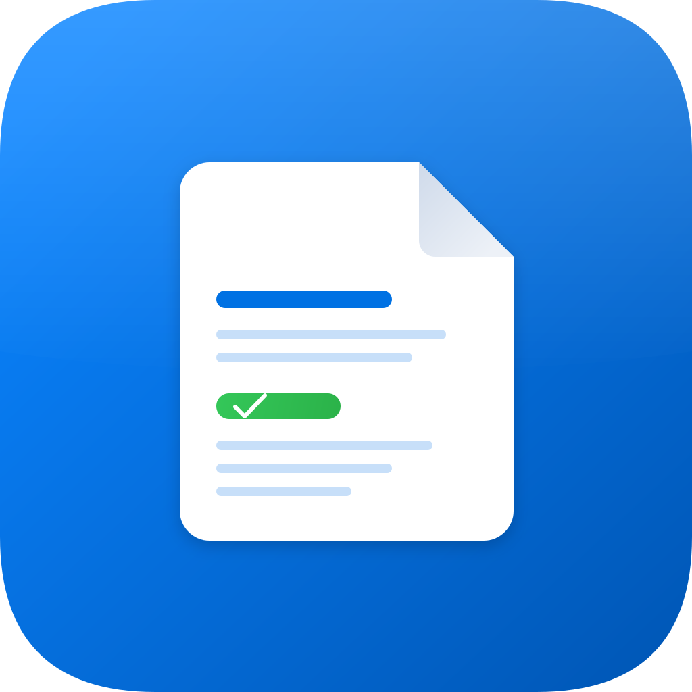
</p>

<h1 align="center">SCORM → Notion</h1>

<p align="center">
  <a href="https://nodejs.org/"></a>
  <a href="#seguridad"></a>
  <a href="https://developers.notion.com/"></a>
  <a href="LICENSE"></a>
</p>

Convierte las unidades de tus asignaturas en Blackboard a páginas nativas de
Notion para tomar apuntes encima. Pegas la URL de la unidad, la app se encarga
del resto: descarga el contenido autenticado, lo convierte y lo sube como
bloques de Notion con imágenes, vídeos, tablas y listas. Puedes publicar una
unidad o preparar una **cola editable de hasta 10**, cada una con su título y
destino, y consultar el resumen con enlaces al terminar.

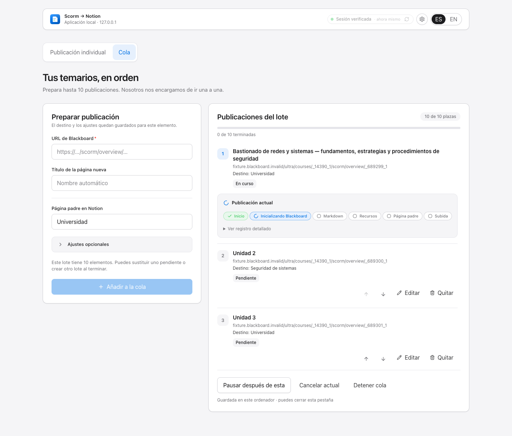

*Interfaz real con datos simulados. Las capturas de la aplicación se regeneran
con `npm run docs:images`; no muestran una cuenta ni publicaciones reales.*

## Índice

- [¿Qué hace esta app y para quién es?](#qué-hace-esta-app-y-para-quién-es)
- [Aviso de uso responsable](#aviso-de-uso-responsable)
- [Requisitos](#requisitos)
- [Instalación](#instalación)
- [Configuración (el `.env`)](#configuración-el-env)
  - [1. Crear la conexión interna de Notion](#1-crear-la-conexión-interna-de-notion)
  - [2. Copiar el token de Notion en `.env`](#2-copiar-el-token-de-notion-en-env)
  - [3. Dar acceso a la página padre en Notion](#3-dar-acceso-a-la-página-padre-en-notion)
  - [4. URL base de Blackboard](#4-url-base-de-blackboard)
- [Uso](#uso)
  - [1. Arranca la app](#1-arranca-la-app)
  - [2. Inicia sesión en Blackboard](#2-inicia-sesión-en-blackboard)
  - [3. Copia la URL de la unidad](#3-copia-la-url-de-la-unidad)
  - [4. Publica en Notion](#4-publica-en-notion)
- [Cola de publicaciones](#cola-de-publicaciones)
- [Ajustes opcionales](#ajustes-opcionales)
- [Solución de problemas](#solución-de-problemas)
- [Seguridad](#seguridad)
- [Referencia técnica](#referencia-técnica)
- [Arquitectura y contratos internos](docs/architecture.md)
- [Guía de desarrollo y diagnóstico](docs/development-guide.md)

## ¿Qué hace esta app y para quién es?

Si tu universidad usa Blackboard con Rise/SCORM y quieres pasar esos apuntes a
Notion para tomar notas encima sin copiar y pegar a mano, esta app lo
automatiza:

- Reutiliza tu sesión real de Blackboard (no se inventa credenciales).
- Descarga el contenido autenticado: textos, imágenes, vídeos.
- Crea una página nueva en Notion con bloques nativos (no como un PDF, no como
  un export raro). Editable, comentable, todo dentro del workspace.
- Guarda la cola en tu ordenador, permite ajustar pendientes durante la
  ejecución y recupera el estado al recargar la interfaz.

La app es 100 % local. No envía nada a ningún servidor que no sea tu propio
ordenador y los servicios oficiales (Microsoft + Blackboard + Notion).

## Aviso de uso responsable

Esta herramienta automatiza la extracción y copia local de contenido
autenticado de Blackboard/SCORM. Muchos centros educativos tratan sus temarios,
materiales docentes y unidades formativas como contenido protegido por derechos
de propiedad intelectual, condiciones de uso internas u otras restricciones
propias. Usar esta app para copiar, conservar, transformar o publicar una unidad
SCORM sin permiso puede incumplir esas condiciones. Ejecútala únicamente sobre
contenido para el que cuentes con autorización explícita de tu universidad,
centro, profesor o titular correspondiente. El uso de la herramienta queda bajo
la responsabilidad exclusiva de la persona que la instala y ejecuta.

Dicho esto, la app funciona de forma local y no incorpora telemetría, avisos ni
mecanismos para notificar a tu universidad lo que haces con ella. No envía
reportes a Blackboard, al centro educativo ni a los autores del material: solo
usa tu sesión autenticada para leer el contenido que ya puedes abrir y, si tú lo
ordenas, subirlo a tu workspace de Notion. Como cualquier acceso normal a una
plataforma online, Blackboard o los servicios implicados pueden conservar sus
propios registros técnicos de actividad, pero esta aplicación no añade ningún
canal de notificación adicional.

## Requisitos

- macOS, Linux o Windows.
- [Node.js 24](https://nodejs.org), versión usada en la validación local.
  Vite 8 admite Node `^20.19.0 || >=22.12.0`; Node 20.0 no basta.
- Google Chrome para la suite visual actual; el navegador de producción
  intenta Chrome y dispone de fallback al Chromium instalado por Playwright.
- Una cuenta de Blackboard en tu universidad.
- Una cuenta de Notion (gratuita sirve).

## Instalación

```bash
git clone https://github.com/jnjambrin0/Scorm-web-scrapping.git
cd Scorm-web-scrapping
npm install
```

Si después de eso Playwright no encuentra un navegador (es raro pero pasa):

```bash
npx playwright install chromium
```

## Configuración (el `.env`)

La app solo necesita **dos valores** en un archivo `.env` para arrancar.
Copia el template:

```bash
cp .env.example .env
```

Abre `.env` con tu editor favorito. Tiene que quedar así:

```bash
NOTION_API_KEY=ntn_xxxxxxxxxxxxxxxxxxxxxxxxxxxxxxxxxxxxxxxxxx
BLACKBOARD_BASE_URL=https://<tu-institución>.blackboard.com/ultra/stream
```


Sustituye `<tu-institución>` por el subdominio real de tu universidad
(el que ya aparece en la URL del navegador cuando estás dentro de Blackboard).

Las secciones siguientes explican cómo conseguir cada valor y, sobre todo, cómo
darle a la conexión permiso real sobre la página de Notion donde quieres
publicar. Este segundo permiso es obligatorio: el token por sí solo no puede ver
ni crear nada dentro de tu workspace.

### 1. Crear la conexión interna de Notion

Notion llama **internal connection** a este tipo de clave privada para un solo
workspace. En algunas pantallas antiguas o textos de ayuda también verás la
palabra "integration"; en este README nos referimos a lo mismo.

Necesitas ser **Workspace owner** para crear una conexión interna. En un
workspace personal normalmente ya lo eres.

1. Entra en
   [notion.so/profile/integrations](https://www.notion.so/profile/integrations)
   con la misma cuenta de Notion donde quieres publicar tus apuntes.
2. En la pantalla **Internal connections**, pulsa **Create a new connection**.

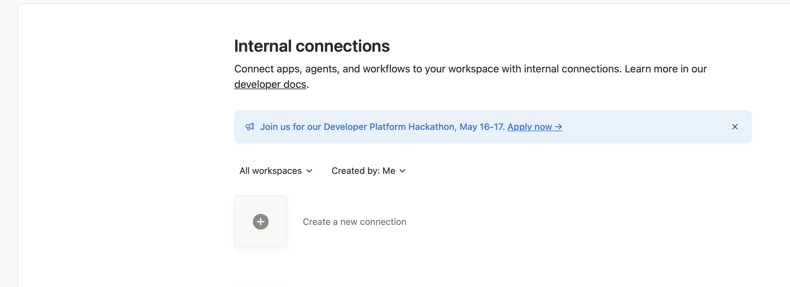

3. En **Connection name**, escribe un nombre reconocible. El README usa
   `SCORM Sync`, pero puedes poner otro.
4. En **Installable in**, elige el workspace correcto. Este punto importa: el
   token solo funcionará en el workspace que selecciones aquí.
5. Pulsa **Create**.

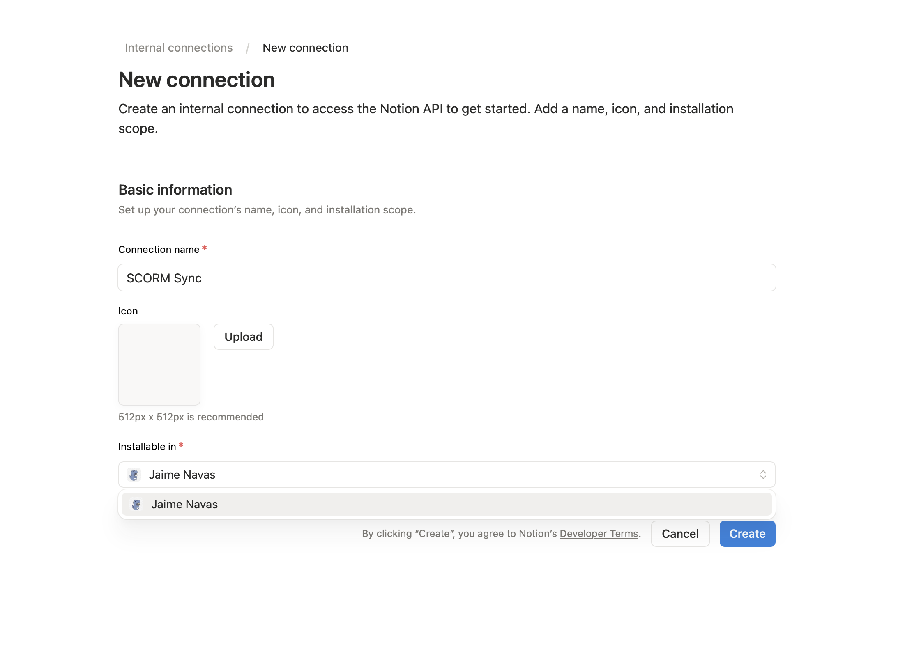

6. Cuando Notion confirme que se ha creado, pulsa
   **Configure connection settings**.

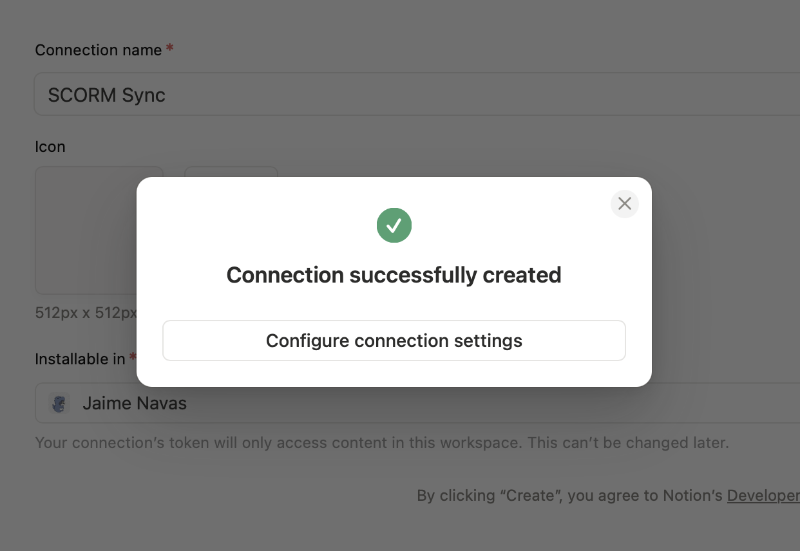

### 2. Copiar el token de Notion en `.env`

Dentro de la conexión, Notion abre la pestaña **Configuration**. Ahí están el
token y las capacidades de la conexión.

1. En **Installation access token**, pulsa **Show**.
2. Copia el valor completo. Es secreto y funciona como una contraseña de API.
3. Pégalo en tu archivo `.env` como `NOTION_API_KEY`.

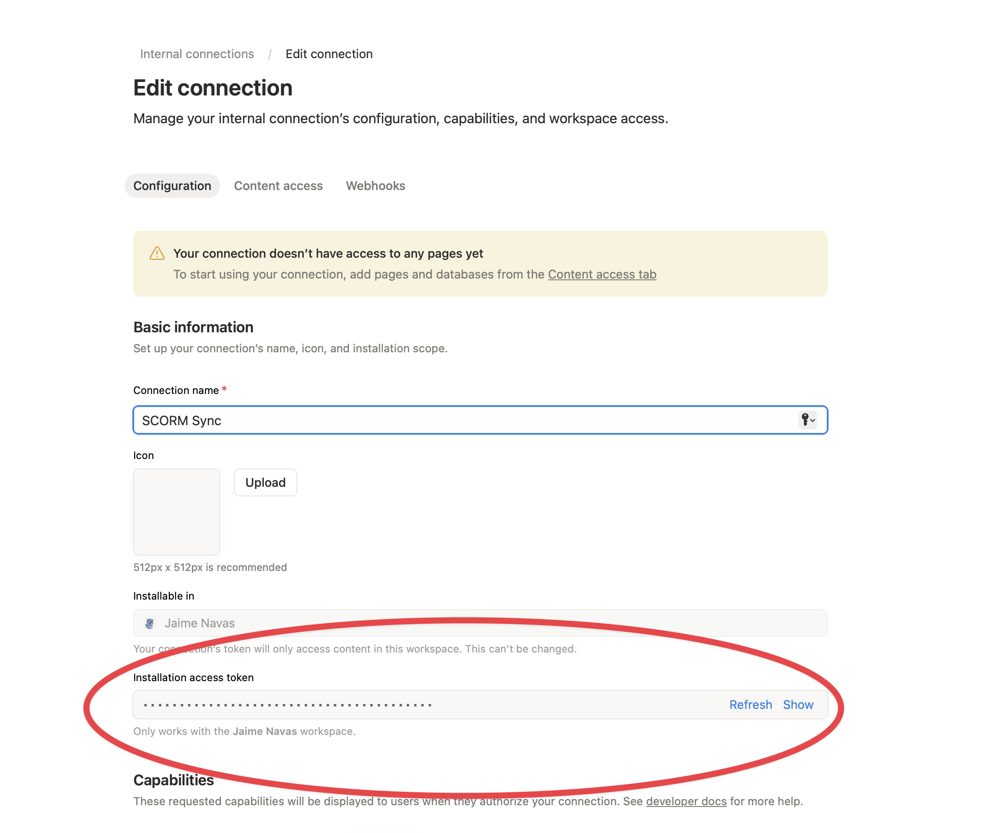

Debajo del token, en **Capabilities**, deja activadas estas capacidades:

- **Read content**: la app puede encontrar o verificar la página padre que le
  indiques.
- **Insert content**: imprescindible para crear la página hija de cada unidad y
  añadir bloques, imágenes, vídeos y archivos.
- **Update content**: necesario para el modo de validación que mueve a la
  papelera la página creada cuando usas `--delete-after` o el ajuste
  **Borrar tras validar**.


### 3. Dar acceso a la página padre en Notion

La app crea cada unidad como una página **hija** dentro de una página que tú
elijas. Esa "página padre" es donde se irán acumulando todos tus apuntes.

El paso crítico es este: una conexión interna recién creada **no tiene acceso a
ninguna página por defecto**. Aunque el token sea correcto, Notion rechazará la
petición si no compartes antes la página padre con la conexión.

1. Crea o elige en Notion una página donde guardar los apuntes. Introduce su
   nombre en **Página padre en Notion** o usa su ID para identificarla sin
   ambigüedad.
2. Vuelve a la configuración de la conexión `SCORM Sync` en el
   [panel de conexiones](https://www.notion.so/profile/integrations).
3. Entra en la pestaña **Content access**.

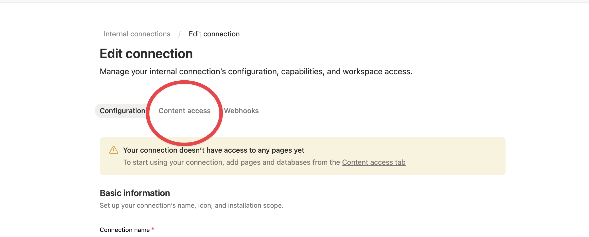

4. Pulsa **Edit access**.
5. En **Select pages**, busca la página padre. En la captura se está buscando
   una página llamada `Educational`; en tu caso puede ser `Universidad`, `U-tad`,
   `Apuntes` o el nombre que hayas elegido.
6. Selecciona la página y pulsa **Save**.

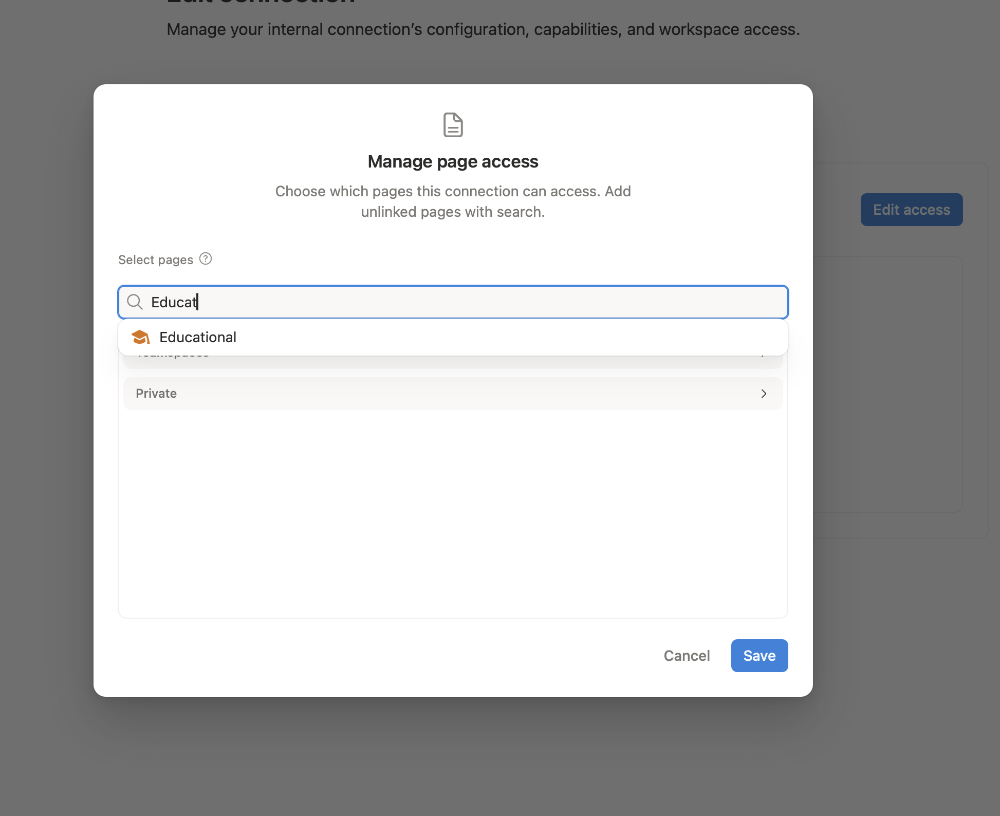

Compartir una página padre con la conexión también le da acceso a sus páginas
hijas. Por eso esta app crea cada unidad SCORM debajo de esa página y no intenta
crear contenido suelto en todo el workspace.

Si la interfaz de Notion cambia, usa la ruta alternativa oficial desde la propia
página: abre la página padre en Notion, pulsa el menú `•••` de arriba a la
derecha, entra en **Connections** / **Add connection**, busca `SCORM Sync` y
confirma el acceso.

Si tienes varias páginas con el mismo nombre, abre los Ajustes de la app y usa
**ID de página padre** para apuntar a una página concreta. Puedes obtenerlo
copiando el enlace de la página desde Notion: el ID es la cadena hexadecimal de
32 caracteres del final de la URL. La app acepta ese ID con o sin guiones.

Sin este paso, verás errores del tipo **"Notion ha rechazado la petición"** o
mensajes de API indicando que la página no existe o no es accesible para la
conexión.

### 4. URL base de Blackboard

Es la URL en la que tu navegador aterriza cuando ya has iniciado sesión en
Blackboard. Tiene esta forma:

```
https://<tu-institución>.blackboard.com/ultra/stream
```

El subdominio cambia según la universidad. Si no estás seguro:

1. Entra a Blackboard como sueles hacerlo desde el navegador.
2. Mira la URL del navegador.
3. Copia la parte hasta `/ultra/stream`.
4. Pégala en `.env` como `BLACKBOARD_BASE_URL`.

## Uso

### 1. Arranca la app

```bash
npm run dev
```

Abre la URL que imprima Vite, normalmente
[http://127.0.0.1:5173](http://127.0.0.1:5173).

Si aparece un banner amarillo "Configuración incompleta", revisa el `.env` y
reinicia el comando.

Tras actualizar el código, detén el servidor anterior con `Ctrl+C`, espera a
que termine y vuelve a ejecutar `npm run dev`: recargar la pestaña no reinicia
el backend. Evita ejecutar dos instancias de la aplicación o una exportación
CLI mientras esté trabajando la cola.

### 2. Inicia sesión en Blackboard

En la barra superior verás un chip de sesión. Posibles estados:

- 🟢 **Sesión verificada** — todo correcto, sigue al paso 3. Cada vez que
  abres la aplicación, Blackboard se comprueba de nuevo en segundo plano; el
  estado verde previo solo evita un parpadeo mientras llega esa respuesta.
- 🟡 **No autenticada** — pulsa **Verificar e iniciar sesión** y confirma
  **Abrir Blackboard** en el diálogo integrado. Se abre una ventana de
  Chromium con Blackboard o el SSO de tu universidad. Introduce credenciales y
  completa MFA a tu ritmo. Cuando aterrice correctamente en Blackboard, la app
  detectará la sesión, cerrará su ventana y mostrará el estado verde.
- 🟠 **Comprobación pendiente** — no se pudo actualizar Blackboard; la app
  volverá a comprobarlo automáticamente al iniciar una exportación.
- ⚪ **Verificando…** — la comprobación silenciosa de arranque sigue en curso.

La aplicación no pide una confirmación del navegador para esa comprobación
automática. Solo cuando Blackboard requiera credenciales aparecerá un diálogo
integrado para abrir el SSO manual. La acción interactiva se puede recuperar
tras recargar la página: la app se reconecta a la tarea existente y vuelve a
mostrar el aviso con **Cancelar**; no crea otro navegador. No abras un segundo
login ni borres archivos `SingletonLock`.

<p align="center">
  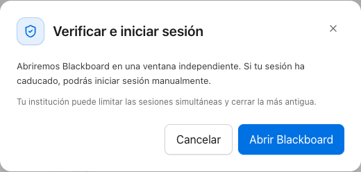
</p>

La sesión se guarda en un perfil local de Chromium. No vuelves a tener que
loguear mientras Blackboard mantenga válida esa sesión. Su duración depende
del centro. La comprobación remota automática puede contar para el límite de
sesiones concurrentes; se aplaza mientras haya una tarea de navegador activa.

### 3. Copia la URL de la unidad

En Blackboard, dentro de tu navegador normal:

1. Entra a la **asignatura** que te interese.
2. Entra al **tema** que quieres convertir.
3. Haz clic en **Apuntes** (o como tu profesor haya llamado al SCORM de la
   unidad).
4. Copia la URL de la página de la unidad (`scorm/overview/...`), antes de
   iniciar el intento. No copies las rutas intermedias `launchFrame` o
   `modern.html` del reproductor.

La URL suele tener esta forma:

```
https://<tu-institución>.blackboard.com/ultra/courses/_COURSE_1/scorm/overview/_ITEM_1
```

La app inicializa primero Blackboard en la misma pestaña del contexto de
exportación. Después navega exactamente a la ruta y parámetros que pegues, salvo eliminar un
fragmento `#...` que no forma parte de la petición. Nunca añade `outline`,
`grades` ni `courseId`. Si el primer intento llega a Stream, reintenta una vez
la misma URL. Después solo seguirá un enlace que Blackboard haya renderizado y que coincida
de forma única con el mismo curso e ítem; no inventa rutas ni adivina entre
varios enlaces.

Algunas instalaciones muestran `/scorm/overview/`, `/outline/scorm/overview/`
o `/grades/scorm/overview/`. La aplicación acepta cualquiera de ellas cuando
la pegas explícitamente. Copia la URL completa de Blackboard, incluyendo sus
parámetros, cuando sea necesario.

### 4. Publica en Notion

De vuelta en la app local:

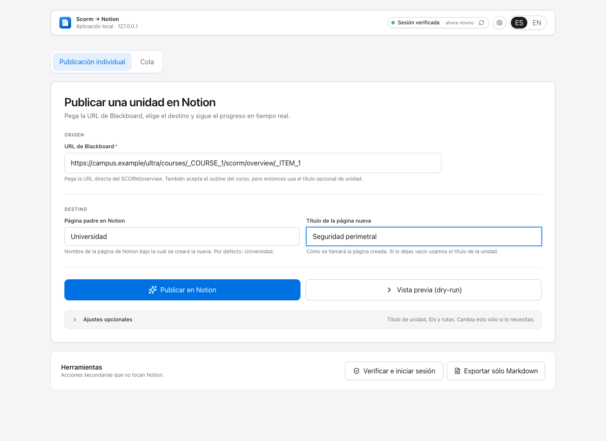

1. Abre **Publicación individual** y pega la URL en **URL de Blackboard**.
2. Comprueba que **Página padre en Notion** dice el nombre de la página que
   compartiste con tu conexión interna (paso 3 de Configuración).
3. (Opcional) Escribe un título para la nueva página de Notion. Si lo dejas
   vacío, se usa el título que ponga la unidad en Blackboard.
4. Pulsa **Vista previa (dry-run)** para una pasada de validación: descarga
   todo y prepara los bloques, **sin tocar Notion**.
5. Si los contadores (lecciones, bloques, imágenes, vídeos) tienen pinta de
   estar bien y los fallos son cero, pulsa **Publicar en Notion**.
6. Espera a que termine — verás barra de progreso y fases. El tiempo depende
   del tamaño de los medios, la red y la disponibilidad de Blackboard/Notion.
7. Al terminar pulsa el botón verde **Abrir página en Notion** para verla en
   tu workspace.

## Cola de publicaciones

Abre **Cola**, crea un lote y añade las URLs. Cada elemento tiene su propio
título opcional y página padre de Notion. Si no indicas título, se usa el del
temario. Los ajustes se guardan al añadirlo; cambiar Ajustes después no cambia
los elementos que ya están en la lista.

Pulsa **Iniciar cola** para publicar. Puedes añadir, editar, quitar y reordenar
los pendientes mientras avanza. El límite es de **10 elementos por lote**, con
los terminados incluidos: quitar un pendiente libera una plaza; terminarlo no.
Se ejecuta una publicación completa cada vez, incluida la subida a Notion.

- **Pausar después de esta** conserva el trabajo actual y no arranca el siguiente.
- **Cancelar actual** cancela esa publicación y pausa los pendientes.
- **Detener cola** cancela el actual y los pendientes; conserva las páginas creadas.
- Un error de temario queda registrado y la cola continúa. Si hace falta login
  o el perfil está ocupado, la cola se pausa con una acción de recuperación.

Puedes recargar o cerrar la pestaña: la cola sigue mientras el servidor local
permanezca abierto. Si reinicias `npm run dev`, se recupera pausada. Un trabajo
interrumpido no se repite automáticamente, porque puede haber creado una página
en Notion. Revisa el resultado y el destino antes de reintentarlo.

Al terminar aparece el resumen con resultados y enlaces. Una publicación
incompleta conserva su enlace; reintentar crea otra página, no repara ni borra
la anterior. Los lotes anteriores quedan disponibles en la misma vista.

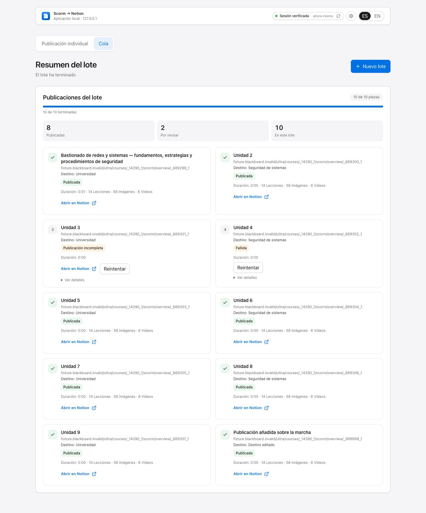

Si un intento pudo crear una página, el reintento requiere revisión explícita:

<p align="center">
  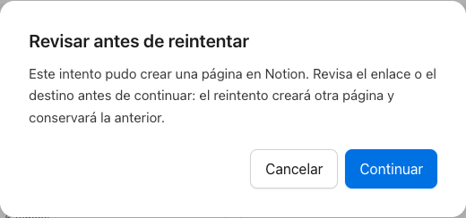
</p>

<details>
<summary>Ver la cola en una pantalla estrecha</summary>

<p align="center">
  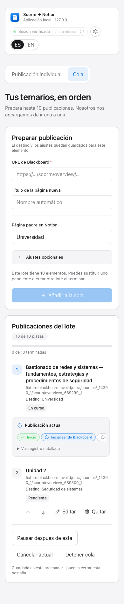
</p>

La interfaz se adapta a pantallas estrechas; la ejecución sigue perteneciendo
al servidor local del ordenador, no a un servicio remoto.

</details>

La cola se guarda en `.local-state/queues.json`, fuera de la caché `exports/` y
excluida de Git. Contiene URLs y destinos introducidos por ti y resultados,
sin cookies ni credenciales. No borres este archivo para resolver un bloqueo
del navegador. Si el almacenamiento falla, corrígelo y reinicia el servidor:
la aplicación conserva el archivo y no inicia nuevas publicaciones.

La cola publica en Notion y nunca activa «borrar después de validar».
Markdown y dry-run siguen en la vista individual.

### Si falla una imagen o un vídeo

El descargador espera al contenido SCORM y usa la URL absoluta del recurso
calculada a partir de la lección. El frame intermedio `scormdriver` no se acepta
como temario listo. Las descargas siguen dentro del navegador autenticado.

Los errores transitorios se reintentan hasta tres veces; un 404 real no genera
rutas alternativas. Los detalles distinguen recurso inexistente, sesión
caducada, respuesta HTML, timeout y fallo de red o política del navegador.
Si alguna descarga sigue fallando, no se publica una página incompleta.

Los recursos completados se guardan progresivamente. Vuelve a intentar la misma
URL sin activar «forzar actualización» para reutilizarlos y descargar solo los
pendientes. No es necesario borrar la caché ni reiniciar la sesión por un 404.

## Ajustes opcionales

Icono de engranaje en la barra superior → modal de Ajustes:

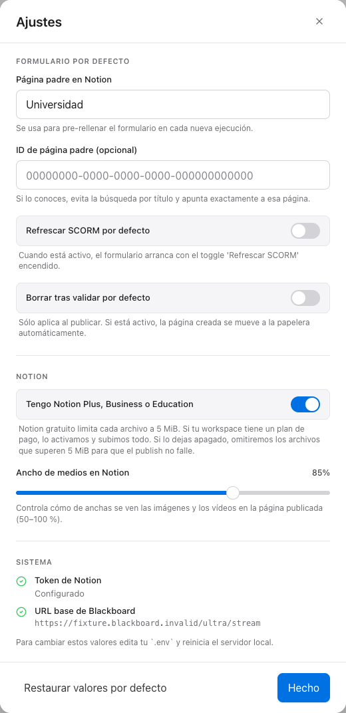

Puedes cambiar:

- **Página padre en Notion**: cambia el valor por defecto del formulario
  (útil si tu página se llama distinto a "Universidad").
- **ID de página padre** (opcional): si tienes varias páginas con el mismo
  nombre y quieres apuntar a una concreta.
- **Refrescar SCORM / Borrar tras validar por defecto**: si te interesa que
  esos toggles arranquen activados.
- **Ancho de medios en Notion**: ajusta cómo de anchas se ven imágenes y
  vídeos en las páginas que se publiquen (50–100 %).
- **Tengo Notion Plus, Business o Education**: controla el filtro de tamaño
  de archivos. Notion limita cada subida a **5 MiB en el plan gratuito** y a
  **5 GiB en los planes de pago** (Plus, Business, Education, Enterprise).
  Activado por defecto porque la mayoría de estudiantes tenéis
  [Notion Education gratis](https://www.notion.com/students). Detalles:
  - **Activado**: se omite el filtro local de 5 MiB; se siguen validando las
    descargas y Notion aplica los límites reales del workspace.
  - **Desactivado**: cualquier imagen o vídeo por encima de 5 MiB se omite
    automáticamente y en su sitio aparece un párrafo `[Imagen omitido: nombre
    — supera 5 MiB del plan gratuito de Notion]`. Así el publish no falla.
  - Si lo dejas activado pero tu workspace es Free, Notion devuelve
    `file_upload_invalid_size`. La app lo detecta y te muestra un error con
    una explicación para desactivar el switch o consultar
    [Education](https://www.notion.com/students) (gratis para estudiantes
    verificados) o pasar a [Plus / Business](https://www.notion.com/pricing).
- **Sistema**: ver de un vistazo si tu `.env` está bien configurado.

Los cambios se guardan automáticamente (no hay botón "Guardar").
El límite de archivos del workspace y el uso de multipart están documentados
en la [guía oficial de archivos y medios de Notion](https://developers.notion.com/guides/data-apis/working-with-files-and-media).

## Solución de problemas

| Síntoma | Qué hacer |
|---|---|
| Banner amarillo **"Configuración incompleta"** | Falta una variable en `.env`. Revisa la sección [Configuración](#configuración-el-env) y reinicia `npm run dev`. |
| Chip dice **"Verificar e iniciar sesión"** ámbar | Tu sesión está caducada (o nunca has hecho login). Pulsa el chip y completa el login; la ventana se cerrará sola al confirmar Blackboard. |
| Chip dice **"Comprobación pendiente"** | Blackboard no se pudo actualizar en segundo plano. La app repetirá la comprobación al exportar; también puedes pulsar el chip para abrir el SSO manual. |
| Error **"El perfil de Blackboard está en uso"** | La verificación automática puede estar usando el perfil durante unos segundos. Si la app muestra una tarea activa, espera o recupérala; solo si indica navegador externo, cierra esa ventana. No borres `SingletonLock` manualmente. |
| **Cola recuperada tras reiniciar** | Revisa los intentos interrumpidos y pulsa **Reanudar cola**. Cerrar la pestaña no detiene el servidor; reiniciar el servidor sí requiere recuperación. |
| **Otra instancia está usando esta cola** | Cierra la otra instancia de la aplicación y reinicia esta. No borres sus archivos de bloqueo ni arranques más servidores para saltarte la exclusión. |
| **No se puede guardar la cola** | Comprueba espacio y permisos del directorio `.local-state/`. Conserva su contenido y reinicia una vez resuelto el problema. |
| **Publicación incompleta / Interrumpida** | Revisa el enlace de Notion o la página padre antes de reintentar: el nuevo intento crea otra página. |
| **No se pudieron preparar todos los recursos** | Revisa el nombre y la causa de cada asset. Reintenta sin forzar actualización para conservar las descargas válidas. Un 404 no demuestra que la sesión haya caducado. |
| Error **"No se ha encontrado el SCORM en el curso"** | La URL terminó en otra página o Blackboard cambió el enlace. Copia de nuevo la URL del SCORM desde Blackboard. |
| Error **"El inicio de sesión no ha terminado"** | La ventana se cerró antes de que Blackboard confirmase la sesión. No hay límite de tiempo para introducir la contraseña; vuelve a verificar e inicia sesión hasta llegar a Blackboard. |
| Error **"La caché de SCORM no es válida"** | La aplicación reconstruirá la caché y conservará la última exportación válida si la nueva navegación falla. Tras una actualización de schema, una regeneración única es normal. |
| Toast **"Blackboard no responde"** | Se agotó una espera de navegación o contenido. Revisa conectividad y detalles técnicos; los límites dependen de la fase. |
| Toast **"URL no accesible"** | Revisa el dominio de Blackboard y la conectividad. Puede ser DNS, conexión rechazada u otro error de red indicado en los detalles. |
| Error **"Notion ha rechazado la petición"** | La conexión interna no tiene acceso a la página padre, el token está mal pegado o falta alguna capacidad. Revisa el paso [Dar acceso a la página padre en Notion](#3-dar-acceso-a-la-página-padre-en-notion). |
| Error **"Notion rechazó un archivo por tamaño"** | Algún archivo supera el límite de tu workspace (5 MiB en Free, 5 GiB en Plus/Business/Education). Ve a Ajustes y desactiva **"Tengo Notion Plus, Business o Education"** para que los archivos grandes se omitan automáticamente, o sube de plan (Education es gratis para estudiantes). |
| Error **"Sesión de Blackboard caducada"** durante un publish | Blackboard requiere autenticación de nuevo. En la cola usa **Iniciar sesión y reanudar**; en publicación individual usa el chip y reintenta. |
| **"Navegador de Playwright no instalado"** | Ejecuta `npx playwright install chromium` en la raíz del proyecto. |

Si nada de lo anterior cuadra, abre los detalles técnicos del toast o de la
tarjeta de error: incluyen las últimas líneas del log con el error real.

## Seguridad

- Todo el flujo es **local**. La API solo escucha en `127.0.0.1:8787` y se
  niega a arrancar en otras direcciones.
- Las cookies de Blackboard se guardan en un perfil de Chromium privado, por
  defecto en `~/.scorm-scraping/chromium-profile`. Trátalo como material
  sensible: si lo copias, copias tu sesión.
- No subas a Git: `.env`, `.local-state/`, `exports/`, `artifacts/` ni el perfil de Chromium.
  Ya están en `.gitignore`, pero conviene saberlo.
- Los logs nunca imprimen tu token de Notion ni cabeceras de autenticación.

## Referencia técnica

Información para quien quiera entender o modificar el código.

### Comandos disponibles

| Comando | Qué hace |
|---|---|
| `npm run dev` | UI (Vite) en `127.0.0.1:5173` + API en `127.0.0.1:8787`. Lo normal para usar la app. |
| `npm run web` | Solo la API; sirve `dist/` si has hecho build. |
| `npm test` | Ejecuta la suite de regresión local con Node. |
| `npm run build` | Comprueba tipos y construye el frontend. |
| `npm run test:ui` | Construye y prueba la interfaz con servicios simulados; guarda capturas en `artifacts/queue-ui/`. |
| `npm run docs:images` | Regenera las siete capturas de la aplicación para este README tras superar la prueba visual. No abre Blackboard real. |
| `npm run docs:check` | Comprueba enlaces locales, imágenes y anclas de la documentación. |
| `npm run login` | Abre Blackboard headed para iniciar sesión manualmente y termina al confirmar Blackboard. |
| `npm run reset-session -- --confirm` | Mueve el perfil local a un backup fechado y deja preparado un perfil limpio. No cierra sesiones remotas. |
| `npm run check-session` | Inspecciona el perfil local sin abrir ventana visible; no confirma el servidor. |
| `npm run check-session -- --remote` | Navega a Blackboard para comprobar el servidor. La interfaz lo ejecuta silenciosamente al arrancar; puede afectar al límite de sesiones concurrentes. |
| `npm run check-session -- --remote --interactive` | Abre Blackboard, permite completar SSO manualmente y confirma/cierra al llegar a Blackboard. |
| `npm run open` | Reabre Blackboard con el perfil guardado (depuración). |
| `npm run open-scorm` | Abre la unidad SCORM configurada y guarda artefactos en `artifacts/`. |
| `npm run export-scorm-md` | Solo Markdown, sin tocar Notion. |
| `npm run export-scorm-notion -- --dry-run` | Valida sin publicar. |
| `npm run export-scorm-notion -- --publish` | Crea la página y sube los medios. Añade `--refresh` para forzar una nueva descarga del SCORM, o `--delete-after` para mover a la papelera tras crear (útil en pruebas). |

### Estructura del proyecto

- **`src/`** — frontend React 19 + Vite 8 + Tailwind v4 (estética macOS
  Sonoma, light mode).
- **`scripts/*.mjs`** — entrypoints CLI de producción (cargan `dotenv/config`)
  y herramientas de documentación aisladas, que no cargan credenciales.
- **`scripts/backend/browser/`** — sesión persistente de Playwright.
- **`scripts/backend/scorm/`** — extracción de Rise/SCORM a Markdown.
- **`scripts/backend/notion/`** — descarga de assets autenticados, conversión
  a bloques nativos, subida vía Notion API.
- **`scripts/backend/web/`** — API local, cola durable, admisión de trabajos y SSE.
- **`docs/architecture.md`** — contratos, ciclo de vida y mapa de persistencia.
- **`docs/development-guide.md`** — guía interna para extender o depurar el
  extractor.
- **`AGENTS.md`** — referencia local para agentes; **`CLAUDE.md`** remite a ella
  para evitar dos copias divergentes. Ambos se mantienen fuera de Git.

### Actualizar esta documentación

Las capturas de la aplicación proceden de fixtures con URLs y resultados
ficticios. Para actualizarlas y verificar enlaces internos:

```bash
npm run docs:images
npm run docs:check
git diff --check
```

Revisa visualmente las imágenes antes de incluirlas en un commit. La guía de
configuración de Notion conserva sus capturas ilustrativas; contrasta cambios
de esa interfaz con su documentación oficial. El procedimiento completo está
en [docs/assets/readme/README.md](docs/assets/readme/README.md).

### Variables avanzadas (raramente necesarias)

| Variable | Uso |
|---|---|
| `SCORM_BROWSER_PROFILE_DIR` | Cambia el perfil de Chromium persistente. Por defecto `~/.scorm-scraping/chromium-profile`. |
| `PLAYWRIGHT_CHANNEL` | Forzar canal de navegador (por defecto Chrome con fallback a Chromium). |
| `WEB_HOST` / `WEB_PORT` | Host/puerto de la API local. Solo acepta `127.0.0.1` o `localhost`. |

### Referencias oficiales de Notion

- [Internal connections](https://developers.notion.com/guides/get-started/internal-connections)
- [Authorization](https://developers.notion.com/guides/get-started/authorization)
- [Connection capabilities](https://developers.notion.com/reference/capabilities)
- [Create a page](https://developers.notion.com/reference/post-page)
- [Append block children](https://developers.notion.com/reference/patch-block-children)
- [Uploading files](https://developers.notion.com/guides/data-apis/working-with-files-and-media)

### Licencia

Publicado bajo licencia [MIT](LICENSE). Puedes usar, modificar y redistribuir
el código libremente.

---

¿Encuentras un bug o se te ocurre algo? Abre una issue en el repo.
