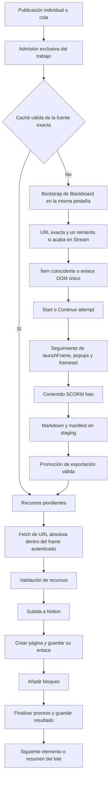

# Arquitectura y contratos

La aplicación es un coordinador local de extracción SCORM y publicación en
Notion. El servidor ejecuta trabajos; React representa su estado. La cola no
depende de mantener abierta la pestaña.

El [README](../README.md) explica el uso. La [guía de desarrollo](development-guide.md)
detalla el extractor y el diagnóstico. Las instrucciones para agentes tienen
una única referencia local: `AGENTS.md`; `CLAUDE.md` remite a ella.

## Flujo de una publicación



Si todos los assets ya están disponibles, se omite su descarga. Si hay que
descargarlos, el exportador abre su propio contexto y recorre otra vez el flujo
compartido de `openScorm()`. Una verificación previa de sesión no inicializa
ese nuevo contexto ni sustituye su bootstrap.

## Responsabilidades

| Capa | Módulos principales | Contrato |
|---|---|---|
| Interfaz | `App`, `useQueue`, `useJob`, `useSessionCheck` | Representa snapshots y envía acciones; no decide qué worker empieza. |
| Admisión | `web/admission.mjs` | Serializa inspección del perfil y creación de trabajos HTTP. La cola reserva el ejecutor. |
| Ejecución | `web/jobs.mjs` | Allowlist, overrides, progreso SSE, cancelación y finalización única en `close`. |
| Cola | `web/queues.mjs`, `queue-store.mjs` | Orden, diez elementos por lote, revisiones, operaciones idempotentes y recuperación durable. |
| Navegador | `browser/context.mjs`, `session.mjs` | Perfil persistente exclusivo; cierre del contexto y navegador antes de liberar el lock. |
| Navegación | `scorm/navigation.mjs`, `urls.mjs` | Fuente inmutable; bootstrap, enlace real coincidente, cadena de popups, frameset y frame listo. |
| Extracción | `overview.mjs`, `lesson-actions.mjs`, `rise-renderer.mjs`, `markdown-exporter.mjs` | Semántica Rise, `baseUri` por lección y exportación transaccional. |
| Recursos | `notion/assets.mjs`, `asset-download.mjs` | Caché por fuente, descarga autenticada absoluta, progreso y diagnóstico por asset. |
| Notion | `exporter.mjs`, `client.mjs`, `uploads.mjs`, `blocks.mjs` | Recursos válidos antes de publicar, uploads, página hija y bloques nativos. |

Los comandos CLI comparten el lock de Chromium, pero no entran en la cola HTTP.
No lanzar exportaciones CLI simultáneas con una cola: el lock del navegador
por sí solo no protege la caché durante la fase de publicación en Notion.

## Tres identidades distintas

| Identidad | Uso | No utilizar para |
|---|---|---|
| URL fuente exacta, sin fragmento | `sourceUrlIdentity` de Markdown y assets | Fabricar rutas alternativas. |
| Origen + curso + ítem | Comprobar un redirect o seleccionar un único enlace real del DOM | Reutilizar caché entre bare, outline y grades. |
| URL absoluta del recurso | Resolver `assets/...` contra el `baseUri` de su lección | Depender del `document.baseURI` de un driver intermedio. |

`launchFrame` o `modern.html` pueden carecer de `itemId`. La pertenencia del
reproductor se valida por origen y relación con la secuencia de apertura del
intento, tanto si ocupa una pestaña como si está embebido en un frameset. Una
pestaña o un iframe previo o ajeno no es una alternativa válida.

El nombre `scormdriver_content` no garantiza que el contenido esté listo.
`waitForFrame()` descarta documentos de driver/reproductor y comprueba la
superficie de contenido. En cada reintento de descarga se adquiere de nuevo
el frame, porque puede haber navegado o haberse sustituido.

## Sesión y exclusión

| Operación | Red / ventana | Significado |
|---|---|---|
| `check-session` | Evidencia local, sin comprobación remota | Perfil con datos; nunca prueba de autenticación vigente. |
| `check-session --remote` | Navegación no interactiva | Comprueba Blackboard sin pedir credenciales; es el autocheck de arranque de la UI. |
| `check-session --remote --interactive` / `login` | Ventana visible | Espera credenciales manuales y termina al confirmar Blackboard. |

La UI recupera los trabajos antes del autocheck y lo aplaza durante una
ejecución activa. Su snapshot en `localStorage` solo aporta continuidad visual.
El intento de «iniciar sesión y reanudar» se conserva en `sessionStorage` y
requiere una verificación posterior a esa solicitud.

Hay dos locks diferentes: el perfil protege Chromium; la reserva de escritor
de la cola protege su archivo frente a otro servidor, incluso en otro puerto.
Los locks de procesos vivos no se eliminan automáticamente. La eliminación
DOM del modal de sesiones concurrentes nunca pulsa su botón «Cerrar».

## Cola y recuperación

Un lote empieza en `draft`, pasa a `running` al iniciarlo y puede quedar
`paused`, `completed` o `stopped`. Los elementos tienen estados `pending`,
`running`, `success`, `failed`, `cancelled`, `incomplete`, `interrupted` o `blocked`.

- El límite de diez incluye los terminados. Quitar un pendiente libera plaza;
  reintentar añade otro intento al mismo elemento.
- Solo los pendientes son editables y reordenables. La configuración queda
  guardada al añadirlos y no cambia al modificar Ajustes posteriormente.
- Pausar deja terminar el actual; cancelar actual pausa; detener cancela actual
  y pendientes. Ninguna de estas acciones borra páginas ya creadas.
- Los fallos de un temario permiten continuar. Sesión inválida o perfil ocupado
  pausan para recuperación; el login sigue siendo una acción deliberada.
- Cerrar la pestaña mantiene la ejecución. Reiniciar el servidor restaura los
  pendientes pausados y exige revisar los intentos interrumpidos.

Los checkpoints IPC `worker-start`, `creating-page`, `page-created` y
`completed` esperan confirmación durable del coordinador. Una página creada
con fallo posterior conserva su enlace. Un checkpoint `completed` permite
recuperar el éxito aunque falte la respuesta final; sin esa evidencia no se
repite una creación incierta automáticamente. El reintento crea otra página:
no es una reparación de bloques ni una garantía de exactly-once remoto.

## API local

| Endpoint | Propósito |
|---|---|
| `GET /api/config/defaults` | Defaults y presencia de configuración, nunca valores de credenciales. |
| `POST /api/jobs` | Crear trabajo individual permitido o compartir un check remoto compatible. |
| `GET /api/jobs/active` | Trabajos activos y disponibilidad saneada del perfil. |
| `GET /api/jobs/:id` | Estado del trabajo. |
| `GET /api/jobs/:id/events` | Historial SSE; filtra por `Last-Event-ID`. |
| `POST /api/jobs/:id/cancel` | Cancelación; si pertenece a la cola, respeta su pausa. |
| `GET /api/queues` | Snapshot completo de lotes y revisión. |
| `POST /api/queues` | Mutación con `operationId`, `revision`, `action` y los datos necesarios. |
| `GET /api/queues/events` | Snapshots SSE completos con revisión y heartbeat. No inicia trabajos. |

Las acciones de cola son `create`, `add`, `edit`, `remove`, `reorder`, `start`,
`resume`, `pause`, `cancel-current`, `stop` y `retry`. Una revisión obsoleta recibe
409; una operación repetida con los mismos datos no vuelve a aplicarse. Para
un retry incierto se necesita `confirmNewPage: true`.

`QueueConfig` incluye `url`, `title`, `parentTitle`, `parentId`, `scormTitle`,
`refresh`, `paidPlan` y `mediaWidthRatio`. La cola nunca activa `deleteAfter`.
Las interfaces de frontend viven en `src/lib/types.ts`.

## Persistencia y datos sensibles

| Ubicación | Contenido y duración |
|---|---|
| Perfil privado de Chromium | Cookies y almacenamiento de sesión. Solo reset reversible con confirmación explícita. |
| `.local-state/queues.json` | Lotes, configuraciones, intentos y resultados durables; independiente de `exports/`. |
| `exports/scorm-export-manifest.json` | Exportación y fuente exacta; staging y promoción tras obtener lecciones. |
| `exports/notion-assets/manifest.json` | Recursos, hashes, estados y diagnóstico; reemplazo atómico y progreso por recurso. |
| `artifacts/` | Evidencia de depuración y capturas de pruebas; no publicar íntegramente. |
| `localStorage` | Ajustes, idioma y última verificación visual; no sesión autenticada. |
| `sessionStorage` | Referencias de recuperación de trabajo/login y solicitud de reanudar. |

Los diagnósticos de descarga excluyen query, hash, cookies y cuerpos HTML.
Los manifests conservan la fuente exacta y URLs necesarias para operar:
tratarlos como datos privados, no como informes listos para compartir. Las
capturas públicas se generan separadamente con fixtures.

## Validación y mantenimiento

```bash
npm test
npm run test:ui
npm run docs:images
npm run docs:check
git diff --check
```

`test:ui` incluye el build. Las pruebas usan servidores locales y perfiles
temporales. Las imágenes y resultados simulados no certifican una publicación
real en U-tad/Notion; esa validación debe hacerse de forma controlada con sesión
autorizada. No fijar contadores históricos de pruebas como criterio de éxito:
consultar el resultado del checkout que se vaya a entregar.
